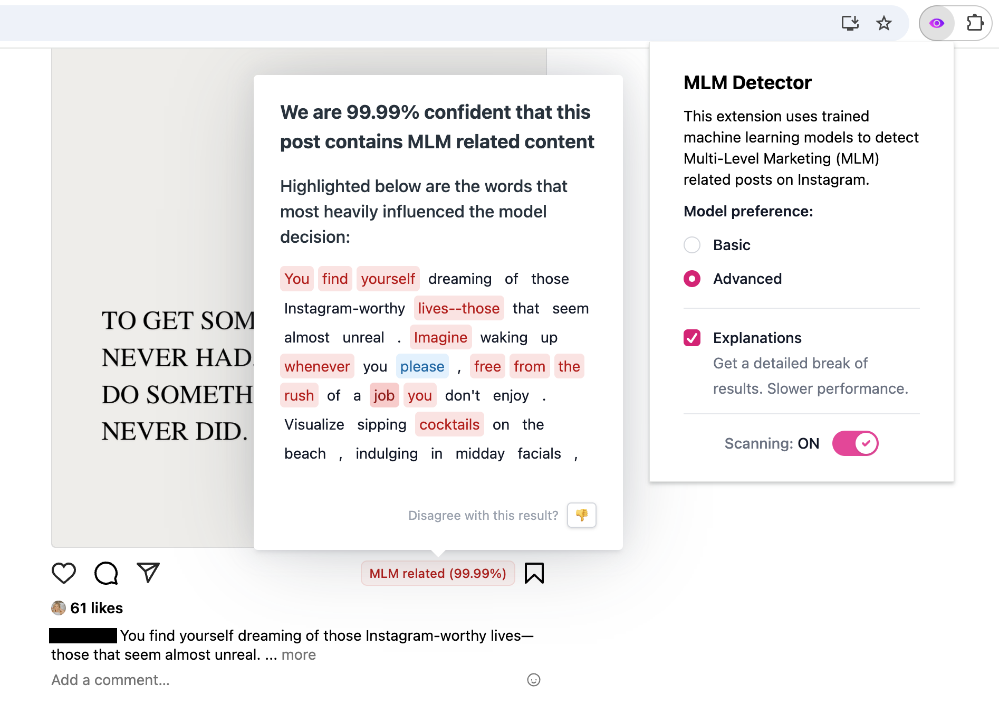

# MLM Post Detector

This repository contains the both **server** (a Flask API) and the **client** (a Chrome extension built with Vite) for detecting Multi-Level Marketing (MLM) related content. It also includes the MLM post **dataset** and a **jupyter notebook** that outlines our model training process.



## Setup Instructions

1. **Clone the repository & install Git LFS**

   Make sure you have [Git LFS installed](https://git-lfs.github.com/).

   ```bash
   git clone https://github.com/whitneymarkov/mlm-post-detector.git
   cd mlm-post-detector
   git lfs pull
   ```

2. **Server Setup**

   The Flask server is located in the `server/` directory.  
   For detailed instructions on installing dependencies and running the server, see the [Server README](server/README.md).

3. **Client Setup**

   The Chrome extension client is located in the `client/` directory.  
   For detailed instructions on installing dependencies, building the extension, and loading it into Chrome, see the [Client README](client/README.md).

## Running the Project

- **Start the Server:**  
  Follow the instructions in the Server README to run the Flask server (by default on `localhost:4200`).

- **Load the Chrome Extension:**  
  Build the client and load the extension into Chrome as described in the Client README. The extension defaults to using the advanced model with SHAP explanations, but settings can be updated via the popup UI in the chrome navigation bar.
